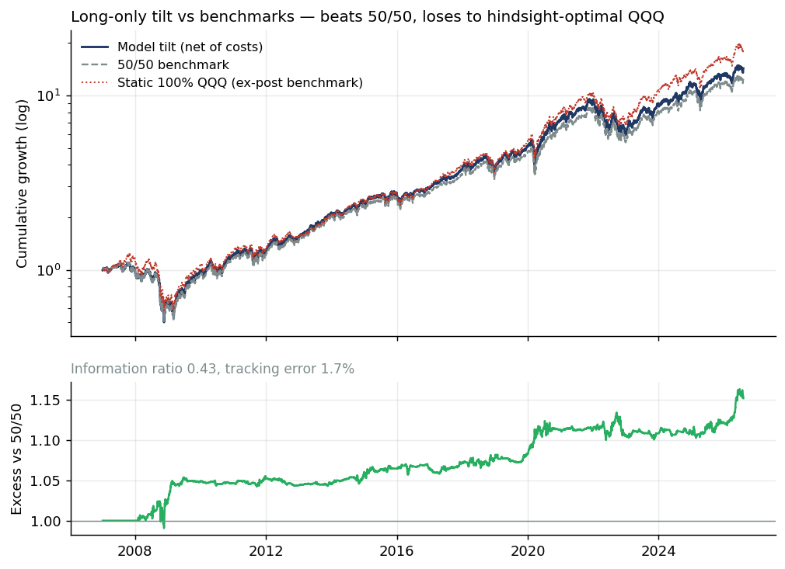
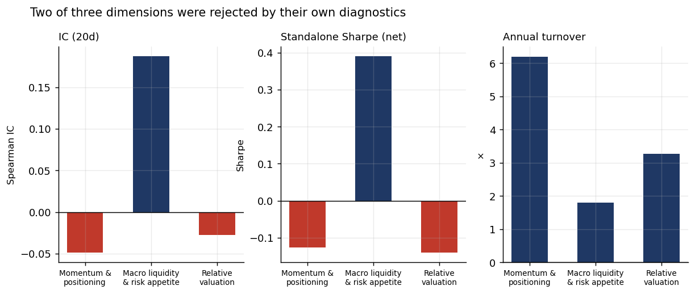
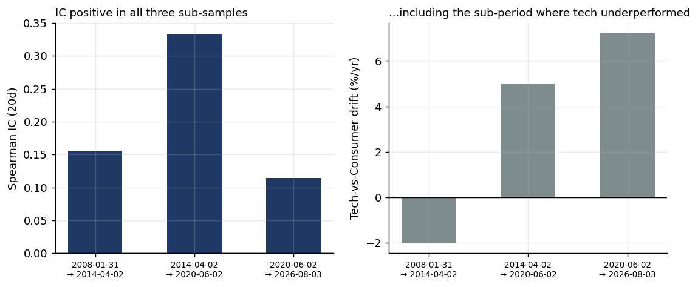
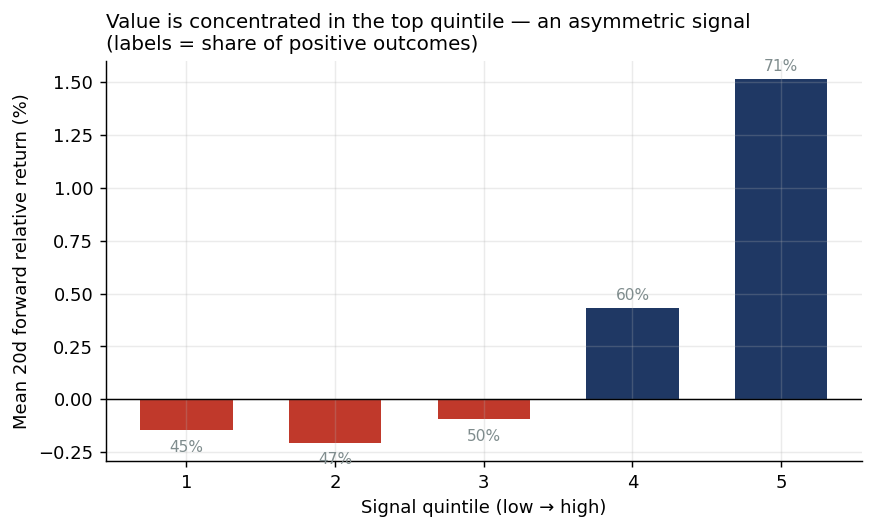
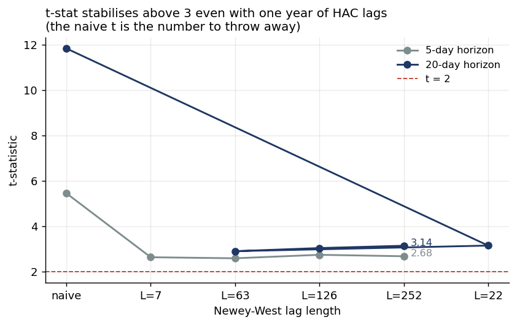

# 美股板块相对配置：一个被自身诊断筛剩一维的宏观流动性信号

**硬科技(QQQ) vs 可选消费(XLY) 的月频相对配置模型。**

项目最初设计了三个维度（动量与持仓、宏观流动性、相对估值）。
经过完整的样本内诊断，**两个维度被自己的数据否决，只剩一个留下来**。
这份 README 记录的是筛选过程和最终结论，而不是一个"一开始就想对了"的故事。

> 研究用途，不构成投资建议。

📄 **英文研究报告**：[REPORT.md](REPORT.md) ｜ [PDF 版](REPORT.pdf)



---

## 一、结论先行

**最终模型**：仅用宏观流动性维度（5 个信号等权），月频调仓，T+1 收盘执行。

| 指标 | 数值 | 说明 |
|---|---|---|
| IC (20日, Spearman) | **0.189** | 60日 IC 更高（0.209），典型慢信号 |
| 方向胜率 (20日) | 57.9% | |
| Newey-West t (20日) | **3.15 → 3.14** | 滞后阶数从 22 天拉到 252 天，t 值稳定不塌 |
| 多空净夏普 | **0.425** | 扣 5bps/腿成本，年化 1.4%，最大回撤 -6.6% |
| 相对 50/50 基准信息比率 | **0.432** | 跟踪误差仅 1.7% |
| 年换手 | 1.61 | 迟滞带 + 月频调仓的结果 |
| 样本 | 2008-01 ~ 2026-08，18.4 年 | 信号方向变号 86 次 ≈ 每年 4.7 次独立押注 |

**三个必须同时说出口的保留意见**见[第四节](#四这个模型的四个硬伤)。
其中最重要的一条：**它跑不赢"一直满仓 QQQ"**（超额夏普 -0.25）。

---

## 二、两个维度是怎么被否决的

这是整个项目最有价值的部分。诊断表由 `./run.sh alldims` 复现。

### 逐维度 IC 与单独策略表现



（下表单独策略统一按月频口径，与最终模型一致；日频下动量维度更糟：夏普 -0.45、年换手 25.0）

| 维度 | IC_5d | IC_20d | IC_60d | 单独净夏普 | 年换手 | 最大回撤 | 结论 |
|---|---|---|---|---|---|---|---|
| 动量与持仓 | -0.024 | **-0.049** | -0.034 | **-0.126** | 6.20 | -34.2% | 否决 |
| 宏观流动性 | +0.085 | **+0.187** | **+0.209** | **+0.390** | 1.81 | -6.8% | 保留 |
| 相对估值 | -0.003 | -0.028 | -0.054 | -0.140 | 3.26 | -34.1% | 否决 |

动量维度不只是无效——它在**持续烧钱**：换手是宏观维度的 3.4 倍，
回撤是它的 5 倍，收益为负。三维等权合成时，它把宏观维度的 +0.187 稀释到 **-0.045**，
Newey-West t 值从 +3.14 拖到 -0.59。留着它没有任何理由。

### 为什么动量在这里失效（一个必须讲清楚的引用错误）

立项时我引用 Moskowitz & Grinblatt (1999) 支持动量维度，**这个引用用错了**。
他们做的是**跨约 20 个行业的横截面动量**；本项目是**两个高度相关板块之间的配对相对动量**。
两者统计性质完全不同：截面动量靠的是赢家组与输家组的排序，
配对相对强弱在短周期上更常见的是均值回归。
数据给出负 IC 是内部一致的，不是数据有问题。

### 宏观维度不是"一个变量在扛"

| 信号 | IC_20d | P1 (08-14) | P2 (14-20) | P3 (20-26) |
|---|---|---|---|---|
| 美联储总资产 60日变化 | 0.120 | 0.157 | 0.286 | 0.029 |
| 信用利差 Baa-10Y 20日变化 | 0.118 | 0.084 | 0.187 | **0.107** |
| 美元指数 60日涨幅 | 0.105 | -0.046 | 0.252 | 0.076 |
| 10年实际利率 60日变化 | 0.053 | 0.136 | 0.051 | -0.035 |
| VIX 20日变化 | 0.038 | 0.055 | 0.051 | 0.020 |
| **合成（等权）** | **0.187** | **0.162** | **0.336** | **0.104** |

两个观察：

1. **合成 IC (0.187) 高于任何单信号（最高 0.120）** —— 分散化确实在降低单信号的特异性噪音，
   而不是把噪音堆在一起。这是保留整个维度、而非只用美联储总资产的依据。
2. **我的先验又错了一次**：立项时假设实际利率是主导变量（久期逻辑），
   实际上它最弱（0.053）且在 P3 变号；真正扛事的是美联储总资产与信用利差。

### 跨 regime 稳健性



| 子样本 | IC_20d | 胜率 | 净夏普 | 该段两板块真实相对漂移 |
|---|---|---|---|---|
| 2008-01 ~ 2014-04 | 0.156 | 56.2% | 0.358 | -2.0%/年 |
| 2014-04 ~ 2020-06 | 0.334 | 62.6% | 0.755 | +5.0%/年 |
| 2020-06 ~ 2026-08 | 0.114 | 55.0% | 0.264 | +7.2%/年 |

三段符号一致，且**在科技逆风段（P1，相对漂移为负）依然为正**——
说明它不是"科技长牛"这一个 regime 的单边押注。

### 分层测试：这是个非对称信号



| 分档 | 平均前瞻相对收益(20日) | 正收益占比 |
|---|---|---|
| 1（最低） | -0.15% | 45.2% |
| 2 | -0.21% | 47.3% |
| 3 | -0.10% | 50.1% |
| 4 | +0.43% | 59.9% |
| **5（最高）** | **+1.52%** | **70.6%** |

价值几乎全部集中在最高档，低档之间没有区分度。
**所以它是"宏观极度支持时超配科技"的确认器，做空一侧没有证据支撑。**
这决定了它该怎么用。

---

## 三、方法论：让结论可被检验

### 3.1 防前视：11 项测试，不是"我很小心"

`./run.sh test`。核心是**截断不变性**：把数据截断到任意历史日期重跑，
截断前的每个信号值必须逐点相同。任何形式的未来信息泄漏都会让它失败。

| 测试 | 检验什么 |
|---|---|
| **截断不变性** | 截断重跑后信号逐点相同 —— 最强的一条 |
| **三种权重方案截断不变性** | 权重本身也不能偷看未来（IC 加权最易翻车） |
| **IC 加权实现滞后** | 只改 cut 之后的收益，cut 之前的权重必须纹丝不动 |
| 滚动 z-score / 分位数因果性 | 篡改未来值不改变过去 |
| 宏观发布滞后 | 观测日打阶跃，首次影响日 ≥ 观测日 + 发布滞后 |
| 前瞻收益对齐 | IC 区间与 `position.shift(lag)` 严格一致 |
| 随机打乱无 edge | 打乱后 IC ≈ 0，排除结构性泄漏 |
| 完美预知对照 | 用真实未来收益当信号必须赚大钱，否则 shift 写反了 |
| 逆波动确实平衡风险 | 验证 1/σ 压缩了维度风险贡献离散度 |
| 迟滞带降换手 | 工程逻辑自检 |

**时序约定**：T 日收盘出信号 → T+1 收盘执行 → T+2 起计收益（`execution_lag=2`）。
宏观序列按真实发布滞后对齐（DFII10/BAA10Y/VIX +1日，DTWEXBGS +4日，WALCL +9日），
顺序是「先滞后 → 再对齐交易日 → 最后做差分」，不可交换。

### 3.2 显著性：把"t 值虚高"变成数字

慢变量 + 重叠前瞻窗口 → 残差严重自相关 → 朴素 t 值系统性夸大。
本项目不满足于口头承认，而是报告 **t 随 Newey-West 滞后阶数的衰减曲线**：



```
20日前瞻: t_naive=11.83 → L=22: 3.15 → L=63: 2.90 → L=126: 3.04 → L=252: 3.14
 5日前瞻: t_naive=5.45  → L=7:  2.63 → L=63: 2.59 → L=126: 2.74 → L=252: 2.68
```

把滞后阶数拉到**一整年**，t 值稳定在 3.1，没有塌。
这条曲线比任何单个 t 值都有说服力；`t_naive=11.83` 本来就该扔掉。

同时报告信号持续性：**ρ₁=0.997，自相关半衰期约 215 个交易日（10.2 个月）**，
18.4 年里方向变号 **86 次**（≈ 每年 4.7 次独立押注）。

> 注：代码也报 AR(1) 有效样本数 `N_eff≈7`，但**这个数不可信**——
> `N(1-ρ)/(1+ρ)` 在 ρ→1 时会机械崩塌给出个位数。
> 真正该看的是 Newey-West 衰减曲线和方向变号次数。报告里已标注这一点。

### 3.3 权重：不拍数字，三种方案摆出来比

维度内取均值（消除同类信号重复计票），维度间三种方案可切换：

| 方案 | IC_20d | 净夏普 | 相对基准IR | 年换手 |
|---|---|---|---|---|
| **equal（默认）** | 0.1894 | **0.425** | **0.432** | 1.61 |
| inverse_vol | 0.1912 | 0.419 | 0.426 | 1.50 |
| ic_weighted | 0.1870 | 0.358 | 0.364 | 1.43 |

三者几乎无差别，**等权最优**——印证了"等权在样本外极难被稳定打败"。
IC 加权（业界常见做法，见 FactSet 参考）在这里没有带来提升，
所以最终就用等权，并把这张表作为"你权重怎么定的"的答案。
另有 `weight_sensitivity()` 提供 300 组 Dirichlet 随机权重的分布检验。

### 3.4 Regime 切换：被自己的检验否决

固定方向先验的隐含假设是"宏观→板块"的传导在任何环境下都一样。这明显可疑：
正常时期降息利好长久期成长股，但衰退期的降息是**对危机的反应**。

做法是：用经济学理由**事先声明**一套 risk-off 乘数（写在 `config.REGIME_MULTIPLIERS`），
再检验它是否真的改善。**不用数据去拟合这些乘数**——全样本只有约 20 段 risk-off，
按 regime 二分再逐信号估参数，几乎必然过拟合。

**状态划分**（信用利差 + VIX 的滚动分位数，双阈值迟滞 0.70/0.50）：
risk-on 68.3%、risk-off 31.7%，各约 20 段，平均持续 160 / 78 个交易日——粒度合理，
没有碎成一堆一两天的片段。

**三个变体同口径对比：**

| 变体 | IC_20d | 净夏普 | 相对基准IR | 最大回撤 | 年换手 |
|---|---|---|---|---|---|
| **baseline（保留）** | **0.189** | **0.425** | **0.432** | -6.6% | 1.61 |
| regime_priors | 0.181 | 0.300 | 0.309 | -8.3% | 1.79 |
| regime_scaled (0.5x) | 0.189 | 0.408 | 0.413 | **-3.8%** | 1.45 |

**判定：不采纳 regime_priors**（ΔIC = -0.009，Δ夏普 = -0.124，两项都变差）。
判定标准在跑之前就声明了：IC 与扣成本夏普必须**同时**改善且超过噪音水平。

**为什么会变差 —— 5 个经济学先验里有 2 个方向就是错的：**

| 信号 | 我的先验 | risk-on IC | risk-off IC | 先验对错 |
|---|---|---|---|---|
| 信用利差 Baa-10Y | 放大 1.5× | 0.100 | **0.146** | ✅ |
| VIX | 放大 1.5× | 0.018 | **0.072** | ✅ |
| 美元指数 | 放大 1.3× | 0.102 | **0.133** | ✅ |
| 美联储总资产 | 衰减 0.5× | 0.083 | **0.169** | ❌ **反了** |
| 10年实际利率 | 衰减 0.3× | 0.066 | 0.039 | ❌ 衰减过度 |

风险类信号在压力期更灵敏——这三个猜对了。
但"压力期的央行扩表是被动救火、信号被污染"这个直觉**是反的**：
美联储扩表信号在 risk-off 下的 IC 是 risk-on 的两倍。
事后看很合理——2009、2020 的 QE 公告恰恰是成长股的转折点，
压力期的扩表不是噪音，而是最强的信号。两个衰减乘数把这部分价值直接掐掉了。

**为什么不按观测到的 IC 重新校准乘数？** 那正是我一开始警告的过拟合：
只有约 20 段 risk-off，拿它去估 5 个乘数，得到的是样本内的完美和样本外的失望。
这个 regime 实验的产出是**一个被证伪的假设 + 一条修正的经济直觉**，不是一组新参数。

**唯一值得保留的发现**：`regime_scaled` 在 IC 完全不变的前提下，
把最大回撤从 -6.6% 砍到 **-3.8%**（对半），代价是夏普从 0.425 降到 0.408。
对真实组合而言这往往是划算的交易。它没有进默认模型（因为夏普是主判据），
但作为风险管理选项是站得住的，用 `--regime` 可复现。

---

## 四、这个模型的四个硬伤

主动列出来，别等被问。

1. **跑不赢"一直满仓 QQQ"**（超额夏普 **-0.25**）。
   辩护：`static_long_leg` 是**事后才知道的**基准——2008 年无法预知科技会碾压消费；
   ex-ante 可辩护的基准是 50/50，对它的信息比率是 0.43、跟踪误差 1.7%。
   但这个辩护只能说到这里：**如果一个投资者的实际替代方案就是买 QQQ 不动，
   这个模型对他没有价值。**

2. **只有超配一侧有证据。** 分层测试价值集中在最高档（+1.52%，胜率 70.6%），
   低档之间没有区分度。做空一侧不该按这个信号执行。

3. **P2 (2014-2020) 明显强于另外两段**（IC 0.334 vs 0.156 / 0.114）。
   虽然三段符号一致，但全样本 IC 有相当部分来自那一段。P3 只有 0.114——
   可能是 alpha 被消化，也可能是 2020 年后 AI 叙事盖过宏观。
   不管哪种，用于当下决策都要打折。

4. **每年只有约 4.7 次独立押注。** 18 年积累 86 次方向切换。
   这个数量级支撑 t≈3 是合理的，但**不足以支撑任何强断言**，
   也意味着未来几年的实际体验会有很大偶然性。

5. **超额收益高度集中在少数月份 —— 这条最伤。**

   | 剔除表现最好的 | 剩余累计超额 |
   |---|---|
   | 0 个月（全样本 236 个月） | +15.2% |
   | 3 个月 | +10.2% |
   | 6 个月 | +6.6% |
   | **12 个月（占 5%）** | **+1.9%** |
   | 24 个月（占 10%） | **-4.5%** |

   236 个月里剔掉最好的 12 个月，超额几乎清零。月度胜率仅 53.8%。
   拆到风险状态看更清楚：**risk-off 期间年化超额 +1.41%（夏普 0.58），
   risk-on 期间仅 +0.41%（夏普 0.35）**。

   **这实际上重新定义了这个模型是什么**：它不是全天候择时器，
   而是一个**压力期信号**——在市场承压、宏观变量剧烈变动时提供信息，
   平静期基本无贡献。这与 3.4 节 regime 诊断的结论互相印证
   （风险类信号在 risk-off 下 IC 显著更高）。
   好的一面是它在最需要的时候起作用；坏的一面是有效样本进一步缩水到
   **少数几段危机**，未来能否复现取决于下一次压力期是否与历史相似。

**其他已知局限**：方向先验固定——regime 切换已实现并检验，但**被数据否决**（见 3.4）；
估值维度用相对价格拉伸度代理而非真实 forward PE（放入 `data/pe_history.csv` 可切换）；
资金流是量价合成代理而非 ETF 真实申赎；多空版未计借券与冲击成本。

---

## 五、快速开始

```bash
pip install -r requirements.txt

cp .env.example .env       # 填入 API key（.env 已在 .gitignore 中）
./run.sh daily             # 抓数据 + 回测 + 开仪表盘
./run.sh test              # 11 项防前视自查
```

| 命令 | 用途 |
|---|---|
| `./run.sh daily` | 抓数据 + 回测 + 仪表盘（日常就用这条） |
| `./run.sh report` | 用缓存跑最终模型（宏观维度 + 月频） |
| `./run.sh alldims` | 三维全开 + 日频，**复现否决过程** |
| `./run.sh macro` / `nomom` | 单维度实验 |
| `./run.sh equal` / `invvol` / `icw` / `compare` | 权重方案 |
| `./run.sh netcheck` | 逐主机连通性诊断（抓数失败先跑这个） |
| `./run.sh test` / `offline` / `clean` | 验证与维护 |

---

## 六、数据源（2026 年现状）

价格按优先级自动回退，**同一次运行不跨源混用**（否则两条腿复权口径不一致）：

| 优先级 | 源 | key | 限流 | 分红复权 |
|---|---|---|---|---|
| 1 | **Tiingo** | 免费 | 500/时 | ✅ |
| 2 | Stooq | 不需要 | 无 | ❌ 有股息偏差 |
| 3 | yfinance | 不需要 | 极严 | ✅ |

宏观走 FRED。**若 `fred.stlouisfed.org` 不通，配一个免费 `FRED_API_KEY` 即可**——
官方 API 在 `api.stlouisfed.org`，是不同主机名，实测常常只有前者被挡
（`./run.sh netcheck` 可确认）。API 用 requests 直连，不需要 `fredapi` 包。

### 踩过的坑：把"授权限制"误诊成"技术故障"

信用利差最初用 `BAMLH0A0HYM2`（ICE BofA 高收益 OAS），只抓到 787 行、2023-08 起。
第一反应是端点静默截断，于是写了多路径重试 + 取最长的逻辑。
去查 FRED 页面才发现真正原因写在 Notes 里：

> *Starting in April 2026, this series will only include 3 years of observations.*

ICE Data 的授权变更让 FRED 只保留滚动 3 年窗口，**换端点、重抓统统没用**。
改用 `BAA10Y`（穆迪 Baa - 10年美债）测同一个东西——信用风险溢价——
无授权限制，有 1986 年至今 40.6 年数据；顺带补入 `VIXCLS`（1990 年至今）
作为独立的风险偏好度量。补全后 P3 的宏观 IC 从 0.071 升到 0.104。

两个教训写进了代码注释：覆盖率检查必须做（否则会把"数据没有"误读成"信号无效"）；
**报警之后要先查数据源说明，再动手改代码**。

---

## 七、与既有工作的关系

**文献先验被数据部分推翻，这本身是结果的一部分：**

- **Molchanov & Stangl (2024), "The myth of business cycle sector rotation",
  *Int. J. Finance & Economics*** —— 传统经济周期板块轮动扣成本后超额消失。
  本项目的三维合成模型（IC -0.045，扣成本夏普 -0.11）与之一致。
- **Moskowitz & Grinblatt (1999), "Do Industries Explain Momentum?", *JF* 54:1249–1290**
  —— 行业动量稳健。但如第二节所述，**该结论不能搬到两两配对上**，
  本项目的配对动量维度呈显著反转。
- **Sarwar, Mateus & Todorovic (2020), *Journal of Asset Management*** —— 美欧板块轮动有效性有限。

**工程参考：**

- [brianbeals/sector-rotation-screener](https://github.com/brianbeals/sector-rotation-screener)
  —— 借鉴其 ALFRED 真实数据窗思路与"跑输基准就在报告顶部挂提示"的做法；
  刻意拒绝其手工设定的 30/30/40 权重。
- [jeff3388/awesome-financial-data-apis](https://github.com/jeff3388/awesome-financial-data-apis)
  —— 数据源优先级的依据。
- [FactSet: A Practical Approach to Weighting Signals](https://insight.factset.com/a-practical-approach-to-weighting-signals)
  —— IC 加权做法与其过拟合风险，本项目收缩系数设计的参考。

---

## 八、实时增强层（明确不进回测）

情绪（FinBERT）与盈利修正在免费源上拿不到足够长、无回填偏差的历史，
硬塞进 18 年回测只会得到假 IC。因此采用"核心 + 卫星"：
回测层只用可长期复现获取的量价与宏观信号；情绪与盈利修正在仪表盘单独展示，
作为对当前打分的**独立确认或证伪**，不参与仓位计算，界面上明确标注。

情绪模型用 FinBERT 而非 VADER —— 后者会把 `beat`、`short`、`bear`
这类财经高频方向性词按通用语义判错。未装 transformers 时自动降级到金融词典法。

---

## 九、文件结构

```
config.py                    板块池、信号定义与方向先验、启用维度、回测参数
run_pipeline.py              端到端：数据→信号→打分→回测→落盘+终端报告
app.py                       Streamlit 仪表盘
run.sh                       统一入口（自动加载 .env）
src/data_fetcher.py          多源价格 + FRED（含覆盖率校验、连通性诊断）
src/signals.py               滚动标准化、发布滞后对齐、方向对齐  ← 防前视核心
src/scoring.py               维度分、三种权重方案、迟滞带与调仓频率
src/backtest.py              IC、逐维度/逐信号拆解、子样本、Newey-West、净值
src/live_layer.py            FinBERT 情绪 + 盈利修正（未回测）
tests/test_no_lookahead.py   11 项防前视与一致性检查
```
