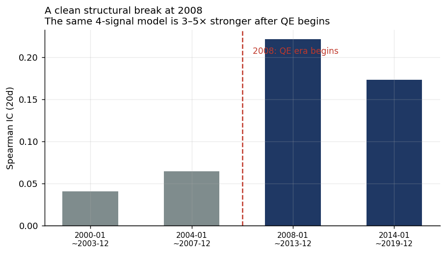
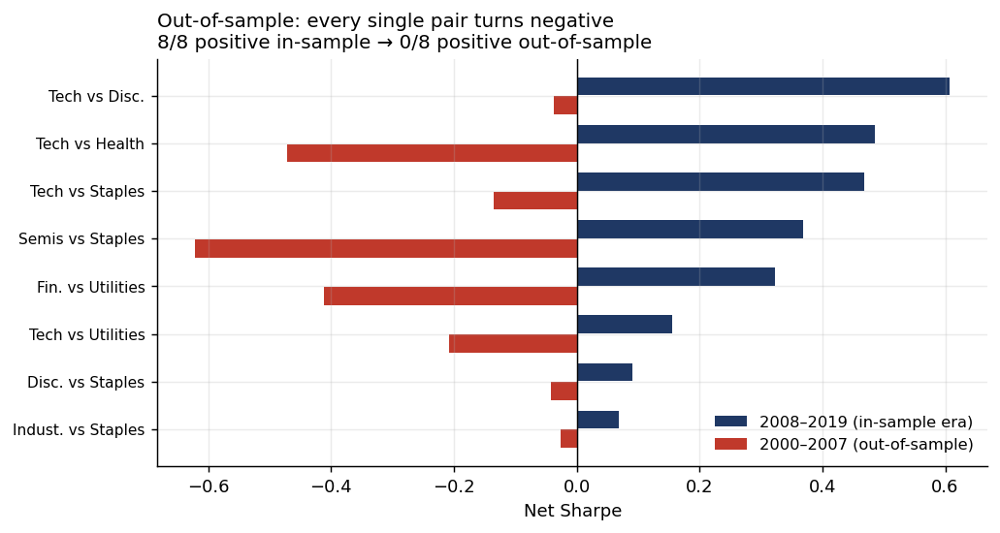
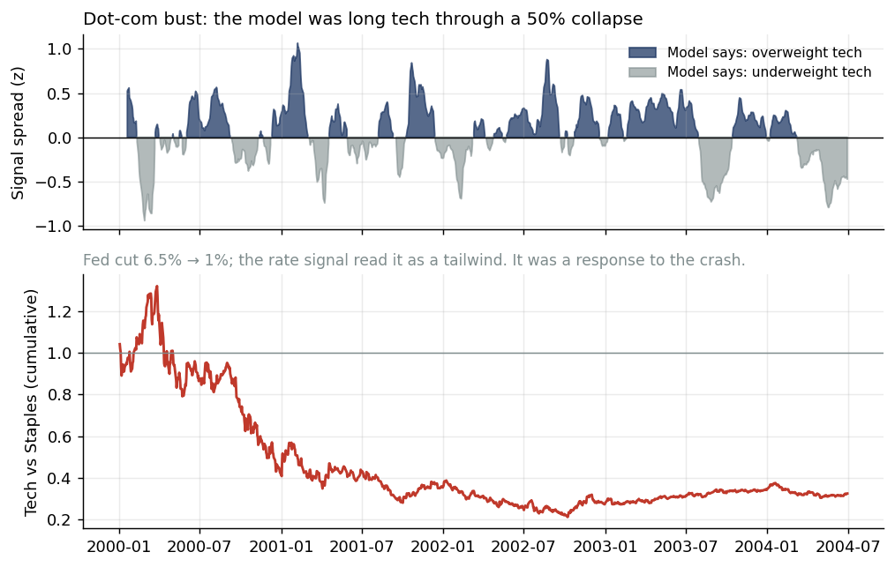

# A Sector Tilt That Passed Every In-Sample Test — and Failed Out of Sample

### Macro liquidity, equity duration, and the boundary of the QE era

**Yuqin (Timothy) Wang** · timothy19won@gmail.com · [github.com/Timothy-yqw19/qdii-sector-rotation](https://github.com/Timothy-yqw19/qdii-sector-rotation)

---

## Executive summary

I built a macro-driven sector tilt for the US market, screened it hard enough to
kill two of its three components, and ended up with something that looked good:
20-day Spearman IC of **0.189**, a Newey-West *t* of **3.14** that holds up under
a full year of HAC lags, positive information ratio against a neutral benchmark,
and the same sign across **8 of 8** sector pairs.

Then I pushed it back to **2000–2007**, a period that never touched a single
design decision. The result:

| | 2008–2019 (design era) | 2000–2007 (out-of-sample) |
|---|---|---|
| Median IC (20d) | **+0.143** | **+0.026** |
| Pairs with positive IC | 6 / 8 | 5 / 8 |
| Median net Sharpe | **+0.346** | **−0.171** |
| **Pairs with positive Sharpe** | **8 / 8** | **0 / 8** |

**The model does not generalise.** Not marginally — every single pair flips
negative. And the failure has a specific, identifiable mechanism, not a
statistical shrug.



The break sits exactly at 2008. The same four-signal model is three to five times
stronger after quantitative easing begins than before it.

**The conclusion this project actually supports** is not "here is a signal." It
is: *the relationship "easier central-bank liquidity → outperformance of
long-duration equity" is conditional on central-bank balance-sheet policy being
the dominant driver of asset prices. That condition held from 2008; it did not
hold before.* Any application of this model has to start by asking whether the
condition still holds today.

---

## 1. The framework, briefly

**Universe.** Relative tilts between US sector ETFs — the decision a sector
allocator actually faces ("overweight which of these two?"), not absolute market
timing. Common beta cancels out of the spread, which raises signal-to-noise.

**Three candidate dimensions,** each with signals whose direction priors carry a
written economic rationale: momentum & positioning, macro liquidity & risk
appetite, relative valuation.

**Timing convention.** Signal at close T → execute at close T+1 → returns accrue
from T+2. Macro series lagged by real publication delay. This convention is
enforced identically in IC computation, weight estimation, and backtest.

---

## 2. In-sample screening: two of three dimensions rejected


| Dimension | IC 20d | Standalone Sharpe | Turnover | Max DD | Verdict |
|---|---|---|---|---|---|
| Momentum & positioning | **−0.049** | −0.126 | 6.20 | −34.2% | **Rejected** |
| Macro liquidity | **+0.187** | +0.390 | 1.81 | −6.8% | Kept |
| Relative valuation | −0.028 | −0.140 | 3.26 | −34.1% | **Rejected** |

Momentum was actively destructive: 3.4× the turnover of the macro dimension, 5×
the drawdown, negative return. Equal-weighting all three diluted +0.187 down to
**−0.045** and dragged the Newey-West *t* from +3.14 to −0.59.

**A citation I got wrong.** I justified the momentum dimension with Moskowitz &
Grinblatt (1999). That was a misapplication: their result is *cross-sectional*
momentum across ~20 industries, whereas this is *pairwise* relative momentum
between two correlated sectors, where short-horizon mean reversion dominates. An
effect documented in one cross-sectional setting does not automatically survive
translation to a two-asset pair — a check that should have happened before the
signal was built.

**The surviving dimension is not one variable in disguise.** The equal-weighted
composite (IC 0.187) beats every individual signal (best: 0.120), so
diversification is genuinely reducing idiosyncratic noise. My prior that the real
rate would dominate was also wrong — it is the weakest of the five. The work is
done by the Fed balance sheet and the credit spread.

---

## 3. In-sample robustness: everything passes

**Sub-samples.** IC positive in all three sub-periods (0.156 / 0.334 / 0.114),
*including* the one where tech actually underperformed — ruling out a disguised
buy-and-hold.

**Significance under autocorrelation.** Slow signals with overlapping windows
inflate naive *t*-statistics, so the full HAC decay curve is reported rather than
a single number:


```
20-day: t_naive = 11.83 → L=22: 3.15 → L=63: 2.90 → L=126: 3.04 → L=252: 3.14
```

Extending lags to a full trading year leaves *t* at 3.14. Signal persistence
ρ₁ = 0.997, half-life ≈ 215 trading days, 86 sign changes over 18.4 years
(≈ 4.7 independent bets per year).

**Payoff shape.** Asymmetric — nearly all value sits in the top quintile
(+1.52%, 70.6% positive); the bottom three are flat and indistinguishable.


**Weighting.** Equal, inverse-volatility and shrunk IC-weighting are
indistinguishable (net Sharpe 0.425 / 0.419 / 0.358) — equal wins, consistent
with the general difficulty of beating it out of sample.

**Cross-pair.** 8 sector pairs, 7/8 positive IC and 8/8 positive Sharpe. And the
strength varies exactly as theory predicts: IC correlates +0.85 with the pair's
gap in foreign-revenue exposure and +0.70 with the gap in equity duration, but
**−0.09 with the gap in beta.** The three near-zero pairs are precisely those
without a duration or foreign-revenue gap. That is mechanism validation, and it
reframes the signal: this is a *duration and dollar-exposure factor*, not a
general rotation tool.

> **A caveat on that cross-pair evidence.** The 8 pairs are not 8 independent
> tests. Their spread signals have a median pairwise correlation of 0.82, the
> first principal component explains 77% of variance, and the effective number
> of independent pairs is roughly **1.6**. Five pairs share tech as the long leg.
> Pooling their 226 episodes into one sample would have been the single most
> misleading thing I could have done — the 226 episodes collapse into 54 distinct
> macro waves.

---

## 4. Regime switching: rejected in-sample, vindicated out-of-sample

Fixed direction priors assume the macro-to-sector transmission is invariant. To
test that, I pre-declared a set of risk-off multipliers from economic reasoning —
never fitted, because ~20 risk-off episodes cannot support estimating five
coefficients — and checked whether they helped.

| Variant | IC 20d | Net Sharpe | Max DD |
|---|---|---|---|
| **Baseline (kept)** | **0.189** | **0.425** | −6.6% |
| Regime-switched priors | 0.181 | 0.300 | −8.3% |
| Regime-scaled exposure (0.5×) | 0.189 | 0.408 | **−3.8%** |

**Rejected** — both IC and Sharpe deteriorated, against a pre-declared acceptance
rule. Three of five priors were directionally right (risk signals do bite harder
under stress); two were backwards. Most notably, I assumed balance-sheet
expansion during stress is "reactive and therefore contaminated" and should be
damped. Post-2008 data said the opposite: its IC in risk-off is *double* its IC
in risk-on. The 2009 and 2020 QE announcements were the turning points.

**Section 5 reverses this verdict.** The damping intuition was correct — for the
pre-QE era. It failed the post-2008 test only because that sample is dominated by
episodes where QE marked the bottom. In 2001–2003 the same reasoning would have
saved the model. What looked like a wrong prior was a prior that is *itself*
regime-dependent — which is a stronger statement about the model's instability
than the original rejection was.

I did not recalibrate the multipliers to the observed ICs. That would have been
exactly the overfitting the pre-declaration existed to prevent.

---

## 5. Out-of-sample: 2000–2007

### 5.1 Design

The 2000–2007 window never informed any design choice — not the dimension
screening, not the signal set, not the monthly rebalance, not the hysteresis band.

Three of five macro signals do not exist before 2007 (TIPS real rate from 2003,
broad dollar index from 2006, Fed balance sheet from 2002), so long-history
substitutes were used: nominal 10-year Treasury for the real rate, the
major-currencies dollar index for the broad one, and **the Fed balance sheet was
dropped entirely** — no honest long-history substitute exists.

**The control that makes this test valid:** both periods run the *same*
four-signal reduced model. Otherwise "worse out of sample" would be
indistinguishable from "fewer signals." Since the major-currencies dollar index
was discontinued in 2020, the comparison window is 2008–2019.

### 5.2 Result



| | 2008–2019 | 2000–2007 |
|---|---|---|
| Median IC (20d) | +0.143 | +0.026 |
| Median net Sharpe | +0.346 | **−0.171** |
| Pairs with positive Sharpe | **8 / 8** | **0 / 8** |

The reduced model still works in 2008–2019 — so the failure is not caused by
dropping the Fed balance sheet. The same four signals simply carry no exploitable
information before 2008.

### 5.3 The failure mechanism



| Period | Mean signal | Days saying "overweight tech" | Realised tech vs staples |
|---|---|---|---|
| 2000-06 – 2001-03 | +0.19 | 69% | **−50.3%** |
| 2001-03 – 2002-10 (Fed cuts 6.5%→1%) | +0.05 | 54% | **−43.9%** |
| 2002-10 – 2003-12 | +0.11 | 73% | +54.4% |
| 2004-01 – 2006-06 (hiking cycle) | −0.12 | 38% | −9.0% |

Through the dot-com collapse the model was long tech roughly two-thirds of the
time. The Fed cut from 6.5% to 1%, and the rate signal read a collapsing discount
rate as a tailwind for long-duration equity. It was not a tailwind — it was the
central bank *responding to* the collapse of exactly those assets.

Segment ICs make the break explicit:

```
2000–2003: +0.041      2004–2007: +0.064
──────────────────────────────── 2008
2008–2013: +0.221      2014–2019: +0.173
```

### 5.4 What this means

The mechanism requires an environment in which central-bank liquidity is the
*dominant marginal driver* of relative equity valuations. That describes
2008–2021 well: balance-sheet policy was the primary tool, and QE announcements
repeatedly marked inflection points for growth equities. It does not describe
2000–2007, when rate cuts were reactive to an equity bust and the balance sheet
was not a policy instrument at all.

**This is a boundary condition, not a bug.** But it is a boundary condition wide
enough to invalidate the model outside it, and the honest framing is that the
in-sample result describes a regime rather than a general market mechanism.

---

## 6. What I would actually claim

Narrowly, and with the conditions attached:

> Between 2008 and 2026, in US sector pairs with a material gap in equity
> duration and foreign-revenue exposure, a diversified macro-liquidity composite
> carried information about one-month relative returns that survived HAC
> correction, sub-sample splits and weighting-scheme sensitivity. That
> information was concentrated in stress periods and on the overweight side, and
> it **does not appear in 2000–2007**, which suggests it is contingent on
> central-bank balance-sheet policy being the dominant driver of asset prices.

What I would *not* claim: that this is a deployable strategy. Even in-sample it
loses to simply holding the tech leg (excess Sharpe −0.25), its excess return is
concentrated in 12 of 236 months, and it generates roughly 4.7 independent bets
per year. Out-of-sample it loses money in every pair tested.

**How it could still be used:** as a regime-contingent overweight-confirmation
input, subject to an explicit check that the enabling condition still holds —
for instance, that central-bank balance-sheet changes still move relative sector
valuations. The moment that check fails, the model should be switched off rather
than trusted.

---

## 7. Method: making the result falsifiable

**Thirteen automated anti-look-ahead tests.** The strongest is **truncation
invariance**: truncate the data at any historical date, re-run the entire signal
chain, and every value before the cut must match the full-sample run point for
point. Any leakage fails it. Others cover rolling z-score and percentile
causality, macro publication lags, forward-return alignment, regime-classification
causality, IC-weight realisation lag, a shuffled-signal null, and a
perfect-foresight control that must be highly profitable or the engine is wired
backwards.

**Data.** Prices from Tiingo (split- and dividend-adjusted, 1998–present), with
Stooq and yfinance as fallbacks and no cross-source mixing within a run. Macro
from FRED via the official API.

**One data incident worth recording.** The credit spread was originally ICE BofA
high-yield OAS, which returned only 787 rows starting 2023-08. I diagnosed silent
endpoint truncation and wrote multi-path retry logic. The real cause was in the
FRED page notes — *"Starting in April 2026, this series will only include 3 years
of observations"* — an ICE Data licensing change that no amount of retrying could
fix. Substituting Moody's Baa minus 10-year Treasury, which measures the same
premium with 40 years of unrestricted history, raised the most recent sub-period
IC from 0.071 to 0.104. Check the data source's own documentation before writing
code against an assumed failure mode.

**Everything rejected is reproducible.** `./run.sh alldims` restores all three
dimensions; `--regime` restores regime switching; `./run.sh oos` reruns the
out-of-sample test.

---

## References

- Molchanov, A. & Stangl, J. (2024). The myth of business cycle sector rotation.
  *International Journal of Finance & Economics*.
- Moskowitz, T. & Grinblatt, M. (1999). Do industries explain momentum?
  *Journal of Finance*, 54, 1249–1290.
- Sarwar, G., Mateus, C. & Todorovic, N. (2020). Gauging the effectiveness of
  sector rotation strategies. *Journal of Asset Management*.
- Newey, W. & West, K. (1987). A simple, positive semi-definite,
  heteroskedasticity and autocorrelation consistent covariance matrix.
  *Econometrica*, 55, 703–708.
- FactSet. A practical approach to weighting signals.

---

*Research exercise. Not investment advice. Backtested results are hypothetical
and do not represent actual trading.*
